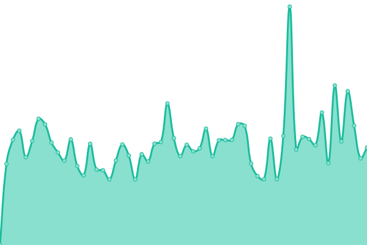
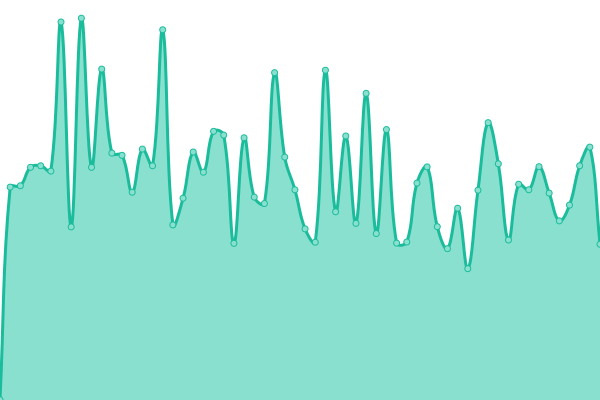
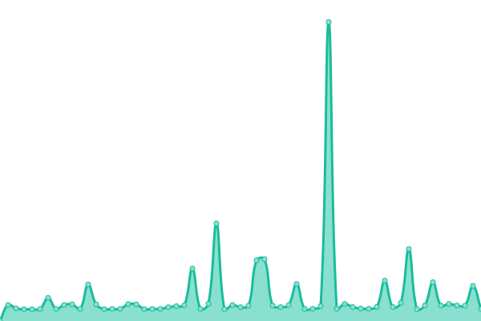
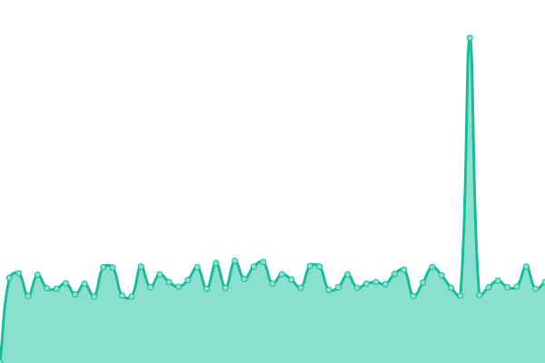

# [📈 Live Status](https://status.truesafeweb.com.br): <!--live status--> **Todos os sistemas estão OK**

This repository contains the open-source uptime monitor and status page for [Maxtel Tecnologia Ltda](https://www.maxtel.com.br), powered by [Upptime](https://github.com/upptime/upptime).

With [Upptime](https://upptime.js.org), you can get your own unlimited and free uptime monitor and status page, powered entirely by a GitHub repository. We use [Issues](https://github.com/Maxtel-Tecnologia/TrueSafe-Web-Status-Page/issues) as incident reports, [Actions](https://github.com/Maxtel-Tecnologia/TrueSafe-Web-Status-Page/actions) as uptime monitors, and [Pages](https://status.truesafeweb.com.br) for the status page.

<!--start: status pages-->
<!-- This summary is generated by Upptime (https://github.com/upptime/upptime) -->
<!-- Do not edit this manually, your changes will be overwritten -->
<!-- prettier-ignore -->
| URL | Status | History | Response Time | Uptime |
| --- | ------ | ------- | ------------- | ------ |
|  TrueSafe Web Site | ativo | [true-safe-web-site.yml](https://github.com/Maxtel-Tecnologia/TrueSafe-Web-Status-Page/commits/HEAD/history/true-safe-web-site.yml) | 

 1244ms
     
 | 

<a href="https://status2.truesafeweb.com.br/history/true-safe-web-site">88.11%</a>
    

|  TrueSafe App API | ativo | [true-safe-app-api.yml](https://github.com/Maxtel-Tecnologia/TrueSafe-Web-Status-Page/commits/HEAD/history/true-safe-app-api.yml) | 

 1129ms
     
 | 

<a href="https://status2.truesafeweb.com.br/history/true-safe-app-api">88.59%</a>
    

|  User BD Site | ativo | [user-bd-site.yml](https://github.com/Maxtel-Tecnologia/TrueSafe-Web-Status-Page/commits/HEAD/history/user-bd-site.yml) | 

 1039ms
     
 | 

<a href="https://status2.truesafeweb.com.br/history/user-bd-site">88.61%</a>
    

|  User BD Comunics | ativo | [user-bd-comunics.yml](https://github.com/Maxtel-Tecnologia/TrueSafe-Web-Status-Page/commits/HEAD/history/user-bd-comunics.yml) | 

 599ms
     
 | 

<a href="https://status2.truesafeweb.com.br/history/user-bd-comunics">88.63%</a>
    

<!--end: status pages-->

[**Visit our status website →**](https://status.truesafeweb.com.br)

## 📄 License

- Powered by: [Upptime](https://github.com/upptime/upptime)
- Code: [MIT](./LICENSE) © [Maxtel Tecnologia Ltda](https://www.maxtel.com.br)
- Data in the `./history` directory: [Open Database License](https://opendatacommons.org/licenses/odbl/1-0/)
